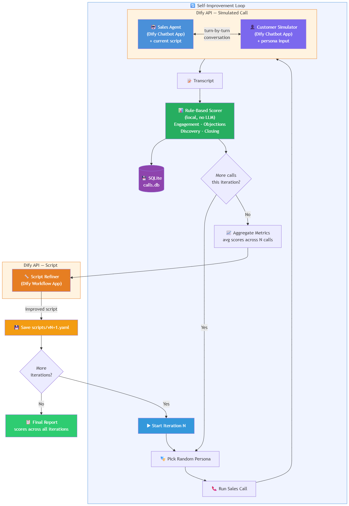

# G1: Self-Improving Call Center Agent

An AI agent that conducts simulated sales calls, evaluates outcomes, and
iteratively improves its own sales script through automated feedback loops.

## Architecture


## Self-Improvement Loop

1. **Simulate** — Agent runs N sales calls against diverse customer personas via Dify chatbot apps
2. **Evaluate** — Each call transcript is scored locally using rule-based heuristics (engagement, objection handling, discovery, closing)
3. **Optimize** — Aggregated scores and transcripts feed into a Dify workflow that rewrites the script
4. **Repeat** — New script is used for the next batch of calls

## Tech Stack

| Component        | Choice             | Reason                                      |
|------------------|--------------------|----------------------------------------------|
| LLM Orchestration| Dify               | Visual flow editing, easy API, multi-app     |
| Sales Agent      | Dify Chatbot App   | Maintains conversation context automatically |
| Customer Sim     | Dify Chatbot App   | Persona-driven via input variables           |
| Script Optimizer | Dify Workflow App  | Structured refinement pipeline               |
| Scoring          | Rule-based (local) | Fast, deterministic, no extra API calls      |
| Database         | SQLite             | Zero setup, sufficient for prototype         |
| Script Format    | YAML (versioned)   | Human-readable, easy to diff                 |

## Dify Setup

You need **three Dify apps** configured before running:

1. **Sales Agent (Chatbot)** — System prompt instructs it to act as a sales rep. Accepts a `current_script` input variable containing the active sales script.
2. **Customer Simulator (Chatbot)** — System prompt instructs it to role-play a customer. Accepts a `persona` input variable with the persona description.
3. **Script Refiner (Workflow)** — Takes `current_script`, `transcripts`, and `metrics` as inputs. Outputs an improved script.

Each app provides an API key that goes into `config.yaml`.

## Setup

```bash
# Prerequisites: Python 3.10+

# Clone / enter project directory
cd g1-call-center-agent

# Create and activate virtual environment
python -m venv venv
.\venv\Scripts\Activate      # Windows
# source venv/bin/activate   # Mac/Linux

# Install dependencies
pip install -r requirements.txt

# Configure
# Copy config.example.yaml to config.yaml
# Set your three Dify app API keys and base URL
```

## Running

```bash
# Full automated simulation (default: 3 iterations × 3 calls)
python main.py

# Override iteration count and calls per iteration
python main.py --iterations 5 --calls 5

# View report from most recent run
python main.py --report
```

## Configuration

Edit `config.yaml`:

```yaml
dify:
  base_url: "https://api.dify.ai/v1"
  sales_agent_api_key: "app-..."    # Dify chatbot app for the sales agent
  customer_api_key: "app-..."       # Dify chatbot app for customer simulation
  refiner_api_key: "app-..."        # Dify workflow app for script refinement

simulation:
  num_iterations: 3              # Number of improvement cycles
  calls_per_iteration: 3         # Calls per cycle
  max_turns_per_call: 14         # Max conversation turns before ending
```

## Project Structure

```
├── main.py                        # Entry point: CLI with --iterations, --calls, --report
├── config.yaml                    # Dify API keys and simulation settings
├── config.example.yaml            # Template config (no secrets)
├── requirements.txt               # Python dependencies
├── image.png                      # Architecture diagram
├── scripts/
│   └── v1.yaml                    # Initial baseline sales script
│   └── v2.yaml                    # (generated) Iteration 1 optimized
│   └── v3.yaml                    # (generated) Iteration 2 optimized
├── data/
│   └── calls.db                   # (generated) SQLite results database
├── src/
│   ├── __init__.py
│   ├── dify_client.py             # Dify API wrapper (chat + workflow, with retry)
│   ├── agent/
│   │   ├── __init__.py
│   │   ├── sales_agent.py         # Sales agent: delegates to Dify chatbot
│   │   └── customer.py            # Customer simulator: persona selection + Dify chatbot
│   ├── pipeline/
│   │   ├── __init__.py
│   │   ├── runner.py              # Main simulation loop: calls → score → refine → repeat
│   │   ├── scorer.py              # Rule-based call transcript scoring
│   │   └── refiner.py             # Triggers Dify workflow for script improvement
│   └── storage/
│       ├── __init__.py
│       └── database.py            # SQLite: stores calls, scores, iterations
└── README.md
```

## Scoring Dimensions

Each call is scored locally (no LLM needed) on four dimensions, each 0–10:

| Dimension           | What It Measures                                                  |
|---------------------|-------------------------------------------------------------------|
| Engagement          | Customer response length, buying signals, negative signals, conversation length |
| Objection Handling  | Whether objections were acknowledged empathetically and resolved  |
| Discovery           | Number and quality of open-ended questions from the agent         |
| Closing             | Whether the agent attempted a close and whether the customer agreed to a next step |

An **overall** score is the equally-weighted average of all four. An **appointment** flag tracks whether the customer explicitly agreed to a demo, trial, or meeting.

## Customer Personas

Six built-in personas provide variety across calls:

- **Skeptical IT Manager** — hates sales calls, demands ROI numbers
- **Curious Startup Founder** — open but budget-conscious, asks many questions
- **Friendly Office Manager** — non-technical, worried about migration disruption
- **Hostile Gatekeeper** — screens calls, not the decision-maker
- **Interested CTO** — actively evaluating solutions, technically demanding
- **Budget-Blocked Director** — genuinely interested but in a spending freeze

Personas are randomly assigned each call. The agent never knows which persona it will face.

## Improvement Logic

After each iteration, the runner sends all transcripts and aggregated metrics to the Dify refiner workflow. The workflow analyzes what worked, what failed, and produces a revised script. Each script version is saved as `scripts/v{N}.yaml` for diffing and review.

## Limitations

1. **Simulated customers are not real customers.** LLM-as-customer tends to be more "reasonable" than real humans. Improvements may not transfer perfectly to real-world calls.
2. **Rule-based scoring is approximate.** Keyword matching can miss nuance. An LLM-based evaluator would be more accurate but slower and costlier.
3. **No A/B testing.** New scripts are tested against random personas, not the same set. A proper evaluation would control for persona variation.
4. **Script optimization quality depends on the Dify workflow's LLM.** If the optimizer misattributes failures, the script could regress.
5. **No rollback mechanism.** If a new script performs worse, the system doesn't automatically revert.

## What I'd Add With More Time

- **A/B testing:** Run identical persona sets against old and new scripts to measure improvement rigorously
- **LLM-based evaluation:** Replace or supplement the rule-based scorer with an LLM evaluator for richer feedback
- **Prompt versioning and rollback:** Auto-revert if a script version scores lower than its predecessor
- **Real voice pipeline:** Add TTS/STT for realistic spoken conversation simulation
- **Dashboard:** Web UI showing metrics, transcripts, and script diffs across iterations
- **Multi-product support:** Parameterize so the same system works for different products and industries