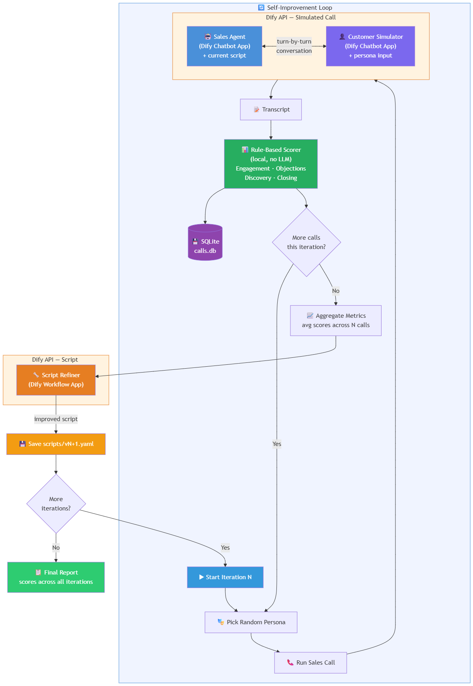
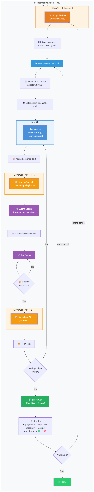

# G1: Self-Improving Call Center Agent

## Demo

https://drive.google.com/file/d/1JHaU5itrQyvJu4rlTQdJP2QdHiJUDVkY/view?usp=drive_link

An AI agent that conducts simulated sales calls, evaluates outcomes, and
iteratively improves its own sales script through automated feedback loops.

## Architecture




## Self-Improvement Loop

1. **Simulate** — Agent runs N sales calls against diverse customer personas via Dify chatbot apps
2. **Evaluate** — Each call transcript is scored locally using rule-based heuristics (engagement, objection handling, discovery, closing)
3. **Optimize** — Aggregated scores and transcripts feed into a Dify workflow that rewrites the script
4. **Repeat** — New script is used for the next batch of calls

## Tech Stack

| Component        | Choice             | Reason                                      |
|------------------|--------------------|----------------------------------------------|
| LLM Orchestration| Dify               | Visual flow editing, easy API, multi-app     |
| Sales Agent      | Dify Chatbot App   | Maintains conversation context automatically |
| Customer Sim     | Dify Chatbot App   | Persona-driven via input variables           |
| Script Optimizer | Dify Workflow App  | Structured refinement pipeline               |
| Scoring          | Rule-based (local) | Fast, deterministic, no extra API calls      |
| Database         | SQLite             | Zero setup, sufficient for prototype         |
| Script Format    | YAML (versioned)   | Human-readable, easy to diff                 |

## Dify Setup

You need **three Dify apps** configured before running:

1. **Sales Agent (Chatbot)** — System prompt instructs it to act as a sales rep. Accepts a `current_script` input variable containing the active sales script.
2. **Customer Simulator (Chatbot)** — System prompt instructs it to role-play a customer. Accepts a `persona` input variable with the persona description.
3. **Script Refiner (Workflow)** — Takes `current_script`, `transcripts`, and `metrics` as inputs. Outputs an improved script.

Each app provides an API key that goes into `config.yaml`.

## Setup

```bash
# Prerequisites: Python 3.10+

# Clone / enter project directory
cd g1-call-center-agent

# Create and activate virtual environment
python -m venv venv
.\venv\Scripts\Activate      # Windows
# source venv/bin/activate   # Mac/Linux

# Install dependencies
pip install -r requirements.txt

# Configure
# Copy config.example.yaml to config.yaml
# Set your three Dify app API keys and base URL
```

## Running

```bash
# Launch the menu (choose: Simulated, Interactive, or Report)
python main.py

# Skip the menu — go straight to simulation
python main.py --mode simulate

# Skip the menu — go straight to interactive call
python main.py --mode interactive

# Override iteration count and calls per iteration
python main.py --mode simulate --iterations 5 --calls 5

# View report from most recent run
python main.py --report
```

### Interactive Mode

In interactive mode, **you** play the customer against the AI sales agent.
If ElevenLabs is configured in `config.yaml`, you can choose between:

- **Voice** — the agent speaks via TTS, you respond by voice (STT)
- **Text** — type your responses in the terminal

If ElevenLabs is not configured, it defaults to text mode.

## Configuration

Edit `config.yaml`:

```yaml
dify:
  base_url: "https://api.dify.ai/v1"
  sales_agent_api_key: "app-..."    # Dify chatbot app for the sales agent
  customer_api_key: "app-..."       # Dify chatbot app for customer simulation
  refiner_api_key: "app-..."        # Dify workflow app for script refinement

simulation:
  num_iterations: 3              # Number of improvement cycles
  calls_per_iteration: 3         # Calls per cycle
  max_turns_per_call: 14         # Max conversation turns before ending
```

## Project Structure

```
├── main.py                        # Single entry point: menu → simulate / interactive / report
├── config.yaml                    # Dify + ElevenLabs API keys, simulation settings
├── config.example.yaml            # Template config (no secrets)
├── requirements.txt               # Python dependencies
├── image.png                      # Architecture diagram
├── scripts/
│   └── v1.yaml                    # Initial baseline sales script
│   └── v2.yaml                    # (generated) Iteration 1 optimized
│   └── v3.yaml                    # (generated) Iteration 2 optimized
├── data/
│   └── calls.db                   # (generated) SQLite results database
├── src/
│   ├── __init__.py
│   ├── dify_client.py             # Dify API wrapper (chat + workflow, with retry)
│   ├── agent/
│   │   ├── __init__.py
│   │   ├── sales_agent.py         # Sales agent: delegates to Dify chatbot
│   │   └── customer.py            # Customer simulator: persona selection + Dify chatbot
│   ├── pipeline/
│   │   ├── __init__.py
│   │   ├── runner.py              # Automated simulation loop: calls → score → refine
│   │   ├── interactive.py         # Interactive mode: user plays customer (voice or text)
│   │   ├── scorer.py              # Rule-based call transcript scoring
│   │   └── refiner.py             # Triggers Dify workflow for script improvement
│   ├── storage/
│   │   ├── __init__.py
│   │   └── database.py            # SQLite: stores calls, scores, iterations
│   └── voice/
│       ├── __init__.py
│       ├── tts.py                 # ElevenLabs text-to-speech
│       └── stt.py                 # ElevenLabs speech-to-text
└── README.md
```

## Scoring Dimensions

Each call is scored locally (no LLM needed) on four dimensions, each 0–10:

| Dimension           | What It Measures                                                  |
|---------------------|-------------------------------------------------------------------|
| Engagement          | Customer response length, buying signals, negative signals, conversation length |
| Objection Handling  | Whether objections were acknowledged empathetically and resolved  |
| Discovery           | Number and quality of open-ended questions from the agent         |
| Closing             | Whether the agent attempted a close and whether the customer agreed to a next step |

An **overall** score is the equally-weighted average of all four. An **appointment** flag tracks whether the customer explicitly agreed to a demo, trial, or meeting.

## Customer Personas

Six built-in personas provide variety across calls:

- **Skeptical IT Manager** — hates sales calls, demands ROI numbers
- **Curious Startup Founder** — open but budget-conscious, asks many questions
- **Friendly Office Manager** — non-technical, worried about migration disruption
- **Hostile Gatekeeper** — screens calls, not the decision-maker
- **Interested CTO** — actively evaluating solutions, technically demanding
- **Budget-Blocked Director** — genuinely interested but in a spending freeze

Personas are randomly assigned each call. The agent never knows which persona it will face.

## Improvement Logic

After each iteration, the runner sends all transcripts and aggregated metrics to the Dify refiner workflow. The workflow analyzes what worked, what failed, and produces a revised script. Each script version is saved as `scripts/v{N}.yaml` for diffing and review.

## Limitations

1. **Simulated customers are not real customers.** LLM-as-customer tends to be more "reasonable" than real humans. Improvements may not transfer perfectly to real-world calls.
2. **Rule-based scoring is approximate.** Keyword matching can miss nuance. An LLM-based evaluator would be more accurate but slower and costlier.
3. **No A/B testing.** New scripts are tested against random personas, not the same set. A proper evaluation would control for persona variation.
4. **Script optimization quality depends on the Dify workflow's LLM.** If the optimizer misattributes failures, the script could regress.
5. **No rollback mechanism.** If a new script performs worse, the system doesn't automatically revert.

## What I'd Add With More Time

- **A/B testing:** Run identical persona sets against old and new scripts to measure improvement rigorously
- **LLM-based evaluation:** Replace or supplement the rule-based scorer with an LLM evaluator for richer feedback
- **Prompt versioning and rollback:** Auto-revert if a script version scores lower than its predecessor
- **Dashboard:** Web UI showing metrics, transcripts, and script diffs across iterations
- **Multi-product support:** Parameterize so the same system works for different products and industries

## Cost Analysis & Business Impact

### Per-Component Pricing

| Component       | Pricing Model                          | Rate                                      |
|-----------------|----------------------------------------|-------------------------------------------|
| DeepSeek V3     | Pay-per-token via Dify                 | $0.27 / 1M input tokens, $1.10 / 1M output tokens |
| DeepSeek V3 (cache hit) | Dify prompt caching              | $0.07 / 1M input tokens                  |
| ElevenLabs TTS  | Subscription (Starter plan)            | $5/mo for 30,000 characters              |
| ElevenLabs STT (Scribe v1) | Pay-per-use                   | ~$0.40 / hour of audio                   |
| Dify            | Self-hosted (Docker)                   | $0 (open-source)                          |
| SQLite          | Local                                  | $0                                        |
| Compute         | Local machine                          | $0 (existing hardware)                    |

### Cost Per Simulated Call (LLM-vs-LLM, No Voice)

A single simulated call averages ~14 turns. Each turn involves two LLM roundtrips (one for the sales agent, one for the customer simulator), plus growing conversation context.

| Item                        | Tokens (est.)         | Cost         |
|-----------------------------|-----------------------|--------------|
| Sales agent (14 turns)      | ~4,000 in / ~2,800 out | $0.0042     |
| Customer simulator (14 turns)| ~4,000 in / ~2,800 out | $0.0042    |
| Script refiner (per call share) | ~3,000 in / ~1,000 out | $0.0012 |
| **Total per simulated call** |                       | **~$0.01**  |

### Cost Per Full Simulation Run (3 Iterations × 3 Calls)

| Item                          | Count | Unit Cost | Total    |
|-------------------------------|-------|-----------|----------|
| Simulated calls               | 9     | $0.01     | $0.09    |
| Script refinement workflows   | 3     | $0.004    | $0.012   |
| **Total per simulation run**  |       |           | **~$0.10** |

Running a complete 3-iteration self-improvement cycle costs roughly **10 cents**.

### Cost Per Interactive Voice Call (Human-on-the-Loop)

When a user plays the customer in interactive mode with voice enabled:

| Item                          | Estimate              | Cost         |
|-------------------------------|-----------------------|--------------|
| DeepSeek (sales agent, 14 turns) | ~4,000 in / ~2,800 out | $0.004   |
| ElevenLabs TTS (agent speech) | ~3,500 characters     | $0.02        |
| ElevenLabs STT (user speech)  | ~2–3 min audio        | $0.02        |
| **Total per voice call**      |                       | **~$0.04**   |

### Comparison to Human Call Center Agent

| Metric                        | Human Agent           | AI Agent (This System) | Ratio         |
|-------------------------------|-----------------------|------------------------|---------------|
| Cost per conversation         | $2.00–3.50            | $0.01–0.04             | **50–350×** cheaper |
| Calls per hour                | 8–12                  | Unlimited (parallel)   | —             |
| Availability                  | 8 hr shift            | 24/7                   | 3× uptime     |
| Script consistency            | Varies by rep         | 100% consistent        | —             |
| Ramp-up time for new script   | Days of retraining    | Instant (YAML swap)    | —             |
| Self-improvement cycle        | Weeks (manual QA)     | ~5 min (automated)     | —             |

Assumptions: Human agent fully loaded cost of $18–25/hr (US mid-market BPO rate), handling 8–12 connected conversations per hour. AI costs use DeepSeek V3 pricing as of April 2025.

### Monthly Projection at Scale

For a hypothetical deployment running 100 outbound calls/day:

| Scenario                      | Monthly Volume | Monthly Cost   |
|-------------------------------|----------------|----------------|
| AI — text only (simulated)    | 3,000 calls    | ~$30           |
| AI — voice (interactive)      | 3,000 calls    | ~$120          |
| Human — 2 full-time agents    | 3,000 calls    | ~$7,000–9,000  |

The AI system achieves **60–75× cost reduction** at this volume while maintaining the ability to self-optimize its script every night at negligible additional cost (~$0.10 per improvement cycle).

### Why DeepSeek

DeepSeek V3 was chosen deliberately over GPT-4o or Claude for the agent and simulator roles. At $0.27/1M input tokens, it is roughly 10× cheaper than GPT-4o ($2.50/1M) and 11× cheaper than Claude 3.5 Sonnet ($3.00/1M), while performing competitively on conversational tasks. For a system that runs many multi-turn conversations in a loop, this cost difference compounds quickly — a full simulation run would cost ~$1.00 with GPT-4o vs. ~$0.10 with DeepSeek.

### Cost of Improvement

One of the system's most valuable properties is that **self-improvement is nearly free**. Each optimization cycle (analyze transcripts → rewrite script) costs ~$0.004 via the Dify refiner workflow. A traditional call center would spend hundreds of dollars in manager time, QA review, and retraining sessions to achieve the same script revision. This means the system can afford to optimize aggressively — running nightly improvement cycles or even per-shift adjustments — with no meaningful cost impact.